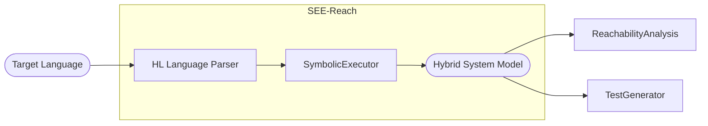

# SEE-Reach-py


*SEE-Reach Notional Diagram*

SEE-Reach is an experimental prototype for symbolic execution of a programming language for closed-loop control software verification and analysis. The tool is designed to extract models from control functions for reachability analysis, determining whether a given state of a system is reachable from a start state under certain conditions. 

The symbolic executor executes on a high-level target language that resembles a small subset of Rust (the intended implementation target), tailored specifically for defining and manipulating the hybrid systems. Important to note, the current version of SEE-Reach does not support loops. The target language has been kept minimalistic for the simplicity and to focus more on the proof of concept.

## Example

The Program
```rust
fn pendulum_dynamics(theta: real, omega: real, kp: real, kd: real) -> tuple {
    // param theta: pendulum angle
    // param omega: angular rate
    // param kp: proportional gain
    // param kd: derivative gain
    
    // get the torque output
    let u: real = controller(theta, omega, kp, kd);
    
    // gravity and length parameters
    let g: real = -9.81;
    let l: real = 2.0;
    
    // state derivative
    let thetap: real = omega;
    let omegap: real = u + g / l * sin(theta);
    return (thetap, omegap)
}

fn controller(x: real, omega: real, kp: real, kd: real) -> real {
    // signal contributions from proportional and derivative
    let up: real = -1.0 * kp * x;
    let ud: real = -1.0 * kd * omega;
    let u: real = up + ud;
    
    // we are torque limited--u must be in [-5.0, 5.0]
    if u < -5.0 {
        return -5.0
    } else {
        if u > 5.0 {
            return 5.0
        } else {
            return u
        }
    }
}
```

Produces the following model for $k_p=1.0, k_d=0.2$,

$0.2 \omega + 1.0 \theta > 5.0$,
$$
\left[\begin{matrix}\theta\\\omega\end{matrix}\right]\rightarrow\left[\begin{matrix}\omega\\- 7.405 \sin{\left(\theta \right)}\end{matrix}\right]
$$
$0.2 \omega + 1.0 \theta < -5.0
$,
$$
\left[\begin{matrix}\theta\\\omega\end{matrix}\right]\rightarrow\left[\begin{matrix}\omega\\- 2.405 \sin{\left(\theta \right)}\end{matrix}\right]
$$
$0.2 \omega + 1.0 \theta \geq -5.0 \wedge 0.2 \omega + 1.0 \theta \leq 5.0
$,
$$
\left[\begin{matrix}\theta\\\omega\end{matrix}\right]\rightarrow\left[\begin{matrix}\omega\\\left(- 0.5 \theta - 4.905\right) \sin{\left(\theta \right)}\end{matrix}\right]
$$

See the [notebook](./SEE-Reach.ipynb) for more. 

## Installation

Install
```shell
pip install z3-solver ply jupyter
```

Run
```shell
jupyter notebook SEE-Reach.ipynb
```

## Current Limitations

While SEE-Reach is a functional prototype, it's under ongoing development. The current version does not support loops and some other advanced features of Rust. Future versions may include a more comprehensive support for the language and additional symbolic execution strategies.

TODO: fill this out a bit more